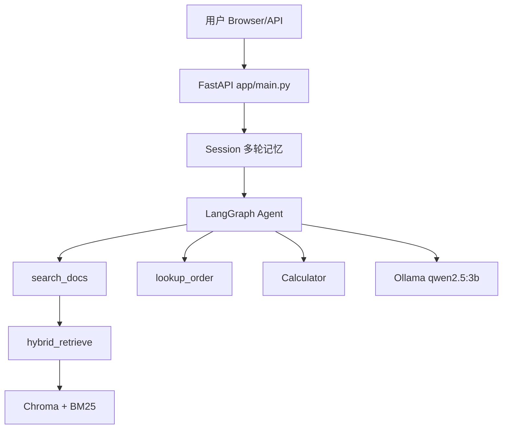

# 企业知识库智能问答 Agent

[Python 3.10+](https://www.python.org/)
[License: MIT](LICENSE)

基于 **RAG + LangGraph** 的私有化部署企业知识库问答系统。支持混合检索、多工具 Agent、多轮对话，可通过 FastAPI 提供 Web 与 API 服务。

[English README](README_EN.md)

---

## 功能特性

- **混合检索**：Chroma 向量检索 + BM25 关键词检索，融合取 Top-K
- **LangGraph Agent**：自动路由知识库检索 / 订单查询 / 计算器
- **多轮对话**：Web 会话保持上下文
- **一键启动**：`start.bat`（Windows）
- **自动评测**：20 条测试集 + `run_eval.py`

---

## 架构




---


## 快速开始


### 环境要求

- Python 3.10+
- [Ollama](https://ollama.com) + `qwen2.5:3b`
- 16GB 内存（CPU 推理）


### 安装

```powershell
git clone https://github.com/yjr998/enterprise-kb-agent.git
cd enterprise-kb-agent

conda create -n kb-agent python=3.10 -y
conda activate kb-agent

pip install -r requirements.txt -i https://pypi.tuna.tsinghua.edu.cn/simple

ollama pull qwen2.5:3b

python scripts/build_vectordb.py
```


### 启动

```powershell
# 推荐：PowerShell / CMD 通用
python run.py

# 或 CMD 批处理
.\start.bat
```

浏览器访问：**[http://127.0.0.1:8000](http://127.0.0.1:8000)**

### API

```powershell
curl -X POST "http://127.0.0.1:8000/api/chat" -F "question=人工智能会取代哪些工作？"
```


### 评测

```powershell
python run_eval.py
```

结果写入 `docs/evaluation_result.json`，填写 `docs/evaluation.md`。

---


## 项目结构

```
enterprise-kb-agent/
├── app/
│   ├── main.py           # FastAPI Web
│   ├── agent.py          # LangGraph Agent
│   └── rag_engine.py     # 混合检索
├── scripts/
│   └── build_vectordb.py # 构建向量库
├── data/
│   ├── knowledge.txt     # 知识库原文
│   └── test_cases.json   # 评测集
├── docs/
├── run_eval.py
├── start.bat
└── requirements.txt
```

---


## 技术栈


| 类别        | 技术                     |
| --------- | ---------------------- |
| 推理        | Ollama (Qwen2.5-3B)    |
| 向量库       | Chroma                 |
| Embedding | BAAI/bge-small-zh-v1.5 |
| Agent     | LangGraph + ToolNode   |
| Web       | FastAPI + Uvicorn      |


推理层可切换为 vLLM / 任何 OpenAI 兼容 API（改 `ChatOllama` 为 `ChatOpenAI` + `base_url`）。

---


## 评测结果


| 指标   | 数值                              |
| ---- | ------------------------------- |
| 测试集  | 20 条                            |
| 通过数  | 20/20                           |
| 成功率  | 100%（本地 qwen2.5:3b + CPU）       |
| 评测说明 | 基础响应率（回答非空且长度 > 5 字即通过） |


---


## License

MIT